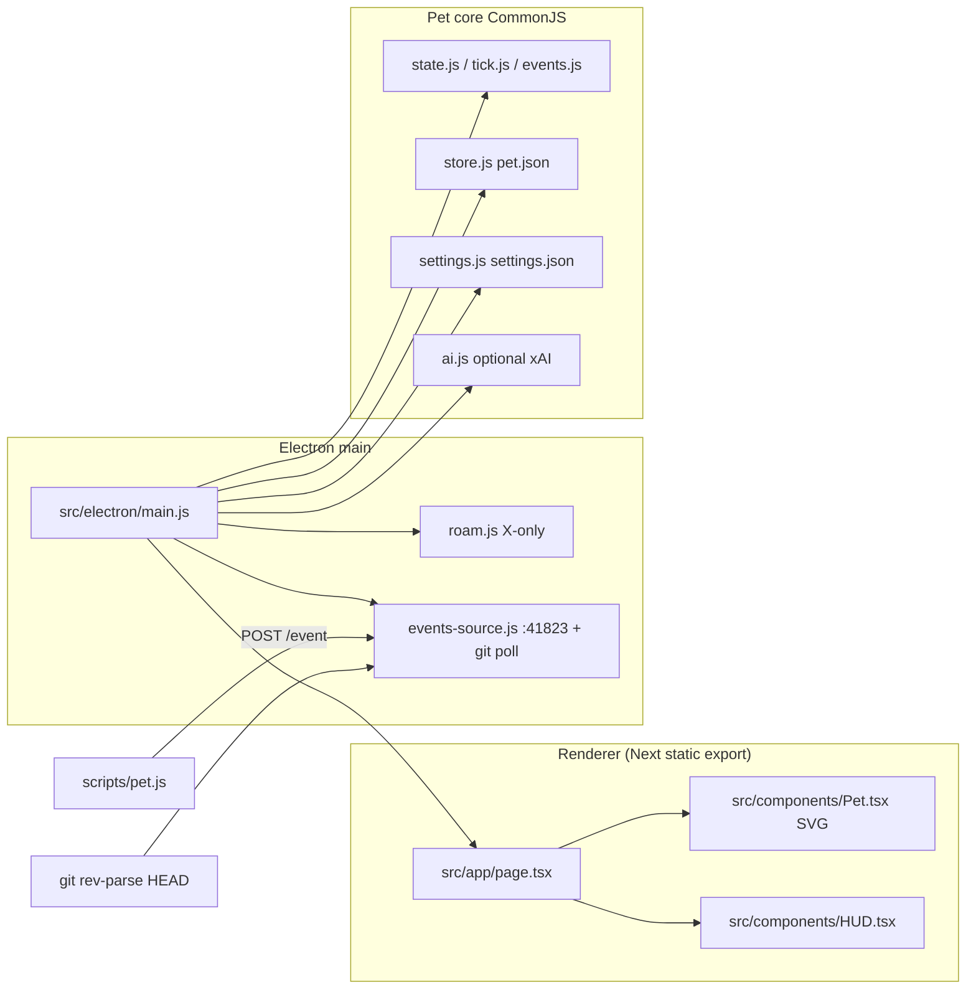
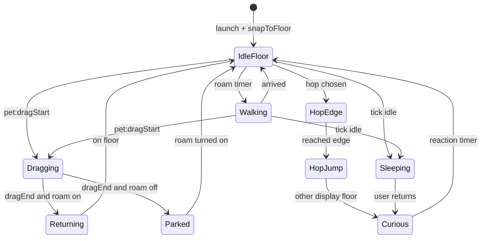
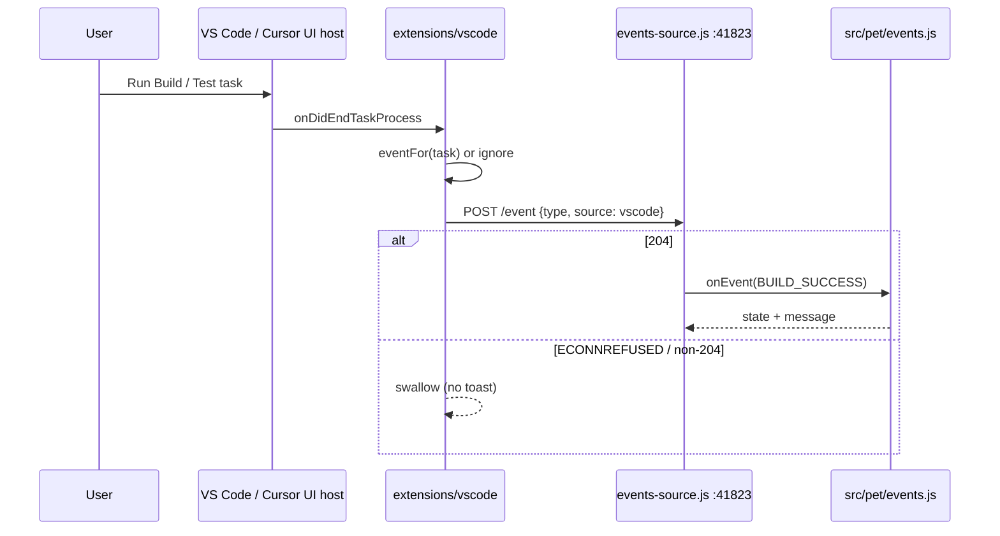
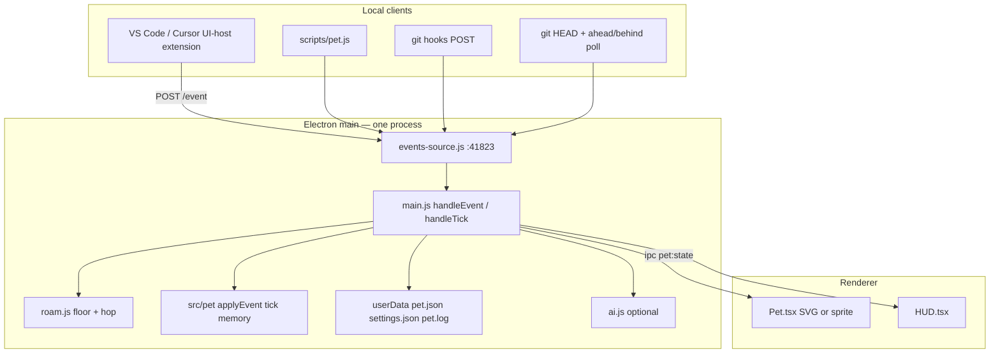
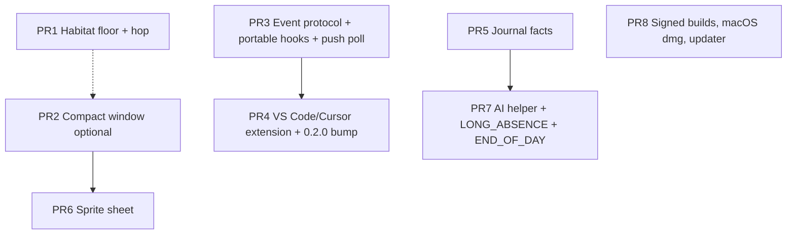

# Desktop Pet v2 Design

| Field | Value |
| --- | --- |
| **Title** | Desktop Pet v2 — a creature that has a life with you |
| **Author** | TBD |
| **Date** | 2026-09-02 |
| **Status** | Approved |
| **Version** | 0.2.0 (from shipped 0.1.0) |
| **Repo** | `https://github.com/munyaimanuwel/desktop-pet` |
| **Audience** | Engineers working in this repo |

---

## Overview

v1 shipped a local Electron + Next static-export companion: Pip, a purple SVG blob in a frameless always-on-top window, with deterministic mood/XP/needs, git polling, a localhost event server, and optional xAI one-liners. It already feels present. It does not yet feel like it *lives here*. Roam (`src/electron/roam.js`) only slides X and preserves the user's Y, so Pip floats in the middle of the monitor. Builds and tests only reach the pet if the developer remembers `npm run pet -- build-success`. Memory is a 40-event type/timestamp log plus today's counters.

v2 keeps the same process model, the same CommonJS pet core, and the same local JSON files. It changes what Pip *does in space* and how work events *arrive*. The highest-leverage slice is **floor walking along the work-area bottom, including a hop to a second monitor**, plus **a tiny VS Code/Cursor extension** that POSTs to the existing `127.0.0.1:41823` server so builds and tests no longer need a manual CLI. The rest of v2 — compact window, sprite sheet, a local journal that can say "you have been red for an hour," quieter-but-richer AI, signed Windows / macOS / GitHub auto-update — is designed here so later PRs have a map, and is sequenced so it can slip without blocking 2.0.

The shippable **2.0 tag is PR1 + PR3 + PR4** (habitat, event protocol, extension). Compact window (PR2) is an optional fast-follow for 2.0.x or 2.1. Sprite, journal, AI, and signed/macOS/auto-update are 2.1.

---

## Background & Motivation

### Current architecture

v1 is three layers, all in-process except the localhost event feed:



| Piece | Where | What v1 actually does |
| --- | --- | --- |
| Window | `src/electron/main.js` `createWindow()` | 340×400, frameless, transparent, `skipTaskbar`, `alwaysOnTop('pop-up-menu')`, click-through with `{ forward: true }`, **global** `CommandOrControl+Shift+P` (same chord as the VS Code / Cursor command palette), tray. Hardware accel disabled on all platforms to fix a Windows blank-surface bug. |
| Character | `src/components/Pet.tsx` + `globals.css` | 200×200 SVG blob. CSS state animations, blink timer, facing, walk-bob, sparkles. |
| Pet state | `src/pet/state.js`, `store.js` | `name, level, xp, happiness, energy, hunger, mood, state, facing, memories[], dayStats, lastEventAt, consecutiveFailures, hatchedAt`. Persisted as `pet.json` under `app.getPath('userData')`. `store.normalize()` is `{ ...base, ...clone(raw) }` then clamps known fields and **returns `merged`**, so unknown keys survive load+save. |
| Tick | `src/pet/tick.js`, 30s in main | Idle → sleepy (5 min) → sleeping (15 min). Hunger/energy/happiness decay. Wake greeting. `handleTick` `speak()`s canned lines only — it never calls `generateLine`. AI generation happens in `commit()` (event path) and `greetIfNeeded()` (`DAILY_GREETING`). `WAKING_UP` is in `SPECIAL` but is a dead generate path today. |
| Events | `src/pet/events.js` | Pure deltas + 60s cooldown (failures exempt). Level-up at `level * 100` XP. |
| Roam | `src/electron/roam.js` | Every 14–40s pick a random X on the **current** display `workArea`. Animate with 32ms `setPosition(x, bounds.y)`. **Y is never chosen.** |
| Drag clamp | `src/electron/main.js` `clampToVisibleArea()` | Called on **every** `pet:dragMove`. AABB-clamps the window into the matching display `workArea`. Does not pin Y to the floor. |
| Ingest | `src/electron/events-source.js` | `POST /event` allowlist on `127.0.0.1:41823`. Git HEAD poll every 20s in `settings.repoDir \|\| cwd`. No body cap; `GET` is 404. `start()` takes `{ onEvent, repoDir, log }`. |
| CLI / hooks | `scripts/pet.js`, `scripts/install-hooks.js` | CLI uses `http.request` with `{ type }` only. Hooks only install into *this* checkout's `.git/hooks` and call this repo's `scripts/pet.js`. |
| AI | `src/pet/ai.js` | `grok-4.6` via `https://api.x.ai/v1/responses`, `store: false`, 3.5s abort, canned fallback. Special events: `LEVEL_UP`, `MULTIPLE_FAILURES`, `DAILY_GREETING`, `WAKING_UP`. Key resolved in main only (`XAI_API_KEY` / `settings.apiKey`); `publicView()` exposes `hasApiKey`. |
| Settings | `src/pet/settings.js` | `normalize()` **reconstructs** a new object from defaults. Unknown keys (including future `lastBounds`) are dropped on load+save. `publicView()` is an explicit whitelist. |
| Speech | `src/pet/speech.js` | `off` / `quiet` / `normal`. |
| Tests | `package.json` `test` | `node --test "src/pet/*.test.js"` only. electron-builder `files` ignore is `!src/pet/**/*.test.js` only. |
| Ship | `package.json` `build` | electron-builder NSIS, `signAndEditExecutable: false`, `publish: []`, version `0.1.0`, output `release/Desktop Pet Setup 0.1.0.exe`. No `requestSingleInstanceLock`. |

### Pain points

1. **Pip does not sit in the world.** Classic desktop pets walk the taskbar. v1 roam explicitly documents "X only — the user keeps the height." After a drag, Pip stays at whatever Y they dropped. On a 1440p display that is usually mid-air.
2. **Builds are invisible unless scripted.** Git commits arrive via poll. Pushes, builds, and tests require `scripts/pet.js` or a hook that only exists in this repo. A developer using Cursor on some other project gets a pet that mostly sleeps and blinks.
3. **Memory is a counter.** `src/pet/memory.js` stores `{ type, at }` and `dayStats`. `recallLine()` can say "5 commits today." It cannot say "you have been red for an hour," "first push in three days," or "you named me Maple yesterday."
4. **The body is a CSS blob.** Readable, charming, but not a walk cycle. Product direction is a 64–96px sprite sheet with the same Pip identity.
5. **Shipping is a Windows unsigned installer.** No Mac, no auto-update, SmartScreen will nag.
6. **The hide/show chord fights the editor v2 is about.** `CommandOrControl+Shift+P` is an OS-level `globalShortcut`. VS Code and Cursor use that chord for the command palette. v1 already steals it; shipping an editor extension on top makes it hostile.

### Why not a rewrite

The pet core is already the right shape: pure functions, `node:test`, additive defaults on load. The event server is already the right integration point for an editor extension. v2 should extend those, not replace them with a framework, a message bus, or a cloud backend.

---

## Goals & Non-Goals

### Goals

**v2.0 (shippable tag = PR1 + PR3 + PR4 — themes #1 and #4)**

- Pip walks the **bottom of the display work area** (taskbar-adjacent on Windows, Dock-adjacent on Mac) whenever Wander is on.
- Pip can **hop to another display** (always, when Wander is on and another display exists) and continue along that display's floor. No extra HUD toggle in 2.0.
- Drag still works: during drag, Y is free within the work-area AABB. With Wander on, **drop** returns Pip to the floor of the display they were dropped on (walk or hop down, not a teleport unless the drop is already on the floor).
- Last window position is restored on launch (then snapped to floor if Wander is on).
- Hide/show default chord changes so it does not steal the VS Code / Cursor command palette. Tray-click remains hide/show.
- A **VS Code / Cursor extension** (one VSIX, both editors) POSTs `BUILD_*` and `TEST_*` to the existing localhost server when **build/test** tasks finish. Local workspace on the same OS as the pet only. No per-repo CLI required.
- Event protocol stays localhost HTTP. Additive fields only. CLI and git poll keep working.
- Watched-repo git hooks can be installed from Settings without depending on this repo's `scripts/pet.js` path.
- `package.json` `version` becomes `0.2.0` on the 2.0 tag so the NSIS artefact is `Desktop Pet Setup 0.2.0.exe`.

**v2.0.x / 2.1 fast-follow (PR2, may land in 2.0.x or slip)**

- Compact pet window (~280×240) with settings HUD in-flow above the sprite so feet stay on the floor.

**v2.1 (planned, independently shippable)**

- Small sprite sheet for walk / blink / sleep / eat, SVG fallback remains.
- Local journal facts with deterministic recall lines (red streak, push gap, rename, long absence).
- Optional AI also covers long absence and end-of-day recap, with a hard cooldown. Canned lines remain the default. Generation is reachable from tick, greet, and commit through one helper.
- Signed Windows NSIS, macOS `.dmg`, quiet auto-update from GitHub Releases.
- Optional: WSL / Remote / Dev Containers event forwarding; title-bar perch; hop opt-out if users complain.

### Non-goals

Out of scope unless the owner later asks (from `project.md` / `AGENTS.md` and the v2 brief):

- Chat UI, conversation-first interaction, prompt box, history transcript.
- Multiplayer, social, sharing, "visit a friend's pet."
- Cloud sync, accounts, telemetry product, analytics pipeline.
- Plugin marketplace, skin marketplace, user-authored characters as a platform.
- Remote pet backends, Kubernetes, event buses, extra daemons.
- Linux packages as a v2 *blocker* (best-effort later; physics should not be Linux-specific).
- Replacing JSON persistence with SQLite/IndexedDB "just in case."
- Replacing the SVG in v2.0; sprite art must not gate floor walking or the extension.
- Compact window as a **2.0 tag requirement** (it is a fast-follow).
- Per-repo npm wrapper as the *primary* build integration (the extension is). A documented one-liner / existing CLI remains for CI.
- Feature-flag service. Per-setting toggles in `settings.json` only.
- A `roamMode` enum or "Also hop screens" checkbox in 2.0.
- Treating every VS Code task (dev server, lint, install, watch) as a build.
- Extension hosts that are not the local desktop (WSL, SSH, Dev Containers) in 2.0.

---

## Key Decisions

1. **Replace X-only roam with a floor habitat; do not add a `roamMode` enum.** Owner-confirmed: Wander on = work-area floor **and hop monitors**. Wander off = parked. **No free-Y roam setting.** v1 mid-air wander goes away. Hop is not a separate HUD checkbox in 2.0 (that would reintroduce the extra-toggle this decision rejected). A hop opt-out only if users complain.

2. **Keep one BrowserWindow.** Floor Y is `workArea.y + workArea.height - window.height`. The renderer already flex-end aligns the sprite to the bottom of the window (`src/app/globals.css` `.stage`). Click-through already ignores empty pixels. A second "pet layer" window would double tray/focus bugs for no gain.

3. **Do not introduce native modules for v2.0 physics.** `screen.getAllDisplays()` / `getDisplayMatching()` / `workArea` are enough for floor + hop. Title-bar perching needs Win32 `GetForegroundWindow` and is **Windows-only, off by default, maybe-never** (own PR after compact, not part of signing/updater). If perching ships, prefer `koffi` FFI over a compiled addon so electron-builder stays boring.

4. **Editor integration is a client of the existing event server, not a new IPC path.** The extension, CLI, and hooks all `POST http://127.0.0.1:41823/event`. Pet core stays unaware of VS Code. Rationale: one allowlist, one cooldown, one applyEvent path (`store.applyEvent` → `handleEvent` in main).

5. **No auth token on the event server in v2.0.** Bind stays `127.0.0.1`. Allowlist stays the six event types. Add a body-size cap (abort on `data`, not after `end`) and optional `source` string. A token file would force every client (extension, hooks, CI) to discover `userData`, which is the harder part. Local-process spoofing can make Pip sad; that is acceptable for a desktop toy.

6. **Journal stays in `pet.json`, not a new database.** Additive fields + a capped `journal[]`. The two normalizers are different: `settings.normalize()` reconstructs and **drops** unknown keys; `store.normalize()` spreads `raw` onto defaults and **keeps** extra keys. v2.1 must still default/clamp new pet fields (`journal` → `[]`, not `undefined`). A second file is only justified if we exceed ~100KB, which 60 facts will not.

7. **AI remains optional, main-process-only, canned-first.** Same `src/pet/ai.js` pattern: never send the key to the renderer, 3.5s timeout, `store: false`, `grok-4.6`. v2 adds a **global cooldown** (30 min) and a **daily cap** (4 lines). New special events: `LONG_ABSENCE`, `END_OF_DAY`. One `maybeSpeakGenerated(event, canned, snapshot)` helper is used from `commit()`, `greetIfNeeded()`, **and** `handleTick`, so `WAKING_UP` / `END_OF_DAY` are not canned-only by accident. After generate, restore `petState = snapshot` (event reaction state) before `speak`, matching today's `commit()`.

8. **Windows is the physics/events proving ground; Mac/Linux are shipping goals, not physics blockers.** `workArea` is the cross-platform floor. `app.dock.hide()` on Darwin is a small main.js branch. Auto-update and signing are a later PR and may wait on certificates.

9. **v2.0 default window stays 340×400; compact HUD is a fast-follow, not in the 2.0 tag.** Pinning Y puts feet on the taskbar immediately. Shrinking is polish (and required before perching). Growing the native window without changing renderer layout does **not** free space for settings — PR2 must move the pinned HUD in-flow above the sprite.

10. **Shippable 2.0 tag is PR1 + PR3 + PR4.** Habitat + event protocol + extension. PR2 (compact) may land in 2.0.x or 2.1. Sprite, journal, AI, and signed/macOS/auto-update are v2.1. Implement PR1 and PR3 first if the schedule only has a weekend. Bump `package.json` `version` to `0.2.0` on the 2.0 tag PR (PR4, last required), not on the signing PR.

11. **Change the global hide/show shortcut.** Owner-confirmed: `Ctrl+Alt+P` / `Cmd+Alt+P` (`CommandOrControl+Alt+P`). Tray-click and the tray/context menu remain hide/show. **Do not keep `Ctrl+Shift+P`.**

12. **Extension v2.0 is local-desktop only.** `extensionKind: ["ui"]` so it runs on the local UI host, not the remote/WSL workspace host. Remote / WSL / Dev Containers are unsupported in 2.0: if `vscode.env.remoteName` is set, write a **one-time** Output-channel note (no toast). Do **not** gate that note on “not UI kind” — a ui-only extension in a WSL window *is* UI-kind, so that extra check would skip the note. Local UI still POSTs if a task event actually arrives; workspace-host tasks typically will not. Do not silently no-op with no explanation.

13. **Unknown editor tasks are ignored, not builds.** Classify using the runtime `TaskGroup.id` (`'build' | 'test'`), falling back to `group.kind` / a string group, then the test-runner regex, then a non-empty valid `desktopPet.taskPattern`. `kind` is a tasks.json schema field, not a property on `vscode.TaskGroup`. Lint / `dev` / install / watch must not drive `MULTIPLE_FAILURES`.

14. **Extension does not own git.** Owner-confirmed: do **not** switch `settings.repoDir` from event `cwd`. Do **not** POST `COMMIT` from the extension. Builds/tests come from whatever folder is open in the editor; git commit polling stays on Settings → Watch repo.

---

## Proposed Design

### 1. Sit in the world (habitat)

#### 1.1 Floor geometry

Electron's `screen` display `workArea` already excludes the Windows taskbar and the macOS Dock/menu. That is the floor.

```js
function floorY(workArea, windowHeight) {
  return workArea.y + workArea.height - windowHeight;
}

function clampX(workArea, x, windowWidth) {
  const minX = workArea.x;
  const maxX = workArea.x + workArea.width - windowWidth;
  if (maxX <= minX) return minX;
  return Math.min(Math.max(x, minX), maxX);
}
```

`createRoam` today:

```45:76:src/electron/roam.js
    const area = screen.getDisplayMatching(bounds).workArea;
    const minX = area.x;
    const maxX = area.x + area.width - bounds.width;
    // ...
      w.setPosition(x, bounds.y);
```

v2 changes that last line to `w.setPosition(x, floorY(area, bounds.height))` on **walk/hop animation frames only**, not only at walk start. Displays can have different `workArea.y` (stacked monitors, taskbar on top, DPI). Pinning once at `start()` and keeping `bounds.y` is how Pip currently walks off the visual floor after a monitor change.

**`clampToVisibleArea()` must remain a work-area AABB clamp** (current behaviour). It is called on every `pet:dragMove`. It must **not** grow a floor-snap branch. If roam-on meant "snap Y inside `clampToVisibleArea`," the user could not lift Pip; every mouse-move would pin Y, and the dragEnd return-to-floor path would never see a real `dy`.

Floor snap is **only** allowed from:

| Caller | When |
| --- | --- |
| Walk / hop animation frames | Wander on, not paused |
| `roam.snapToFloor()` | Launch (after restore `lastBounds`); wander turned on; hop landing |
| `display-added` / `display-removed` / `display-metrics-changed` | Wander on **and roam is not paused for drag** |
| `pet:dragEnd` | Wander on — the **sole** "return to floor after a lift" entry |

Parked (`roam === false`): `clampToVisibleArea` keeps the window on-screen; Y is whatever the user chose.

#### 1.2 Behaviour when Wander is on

Rewrite `src/electron/roam.js` in place (same `createRoam` factory so `main.js` wiring stays). Public API stays `{ schedule, pause, resume, stop, start }` and gains `snapToFloor()`.

Walk loop (same cadence: 14s + random 0–26s, skip if `busy()`):

1. Resolve the display under the window (`getDisplayMatching`).
2. With probability `HOP_P = 0.22` (if another display exists and the last hop was > 2 min ago), choose a **hop**. Otherwise choose a **floor walk** on the current display.
3. Floor walk: pick `targetX` on that work area (same "don't pick closer than 90px" rule as today). Set `state: 'walking'`, `facing`. Animate X with the existing quadratic ease. Every 32ms set Y to that display's `floorY`.
4. Hop: walk to the nearest horizontal edge of the current work area; then **jump** (do not lerp through the bezel — monitors are not a continuous desktop in origin space). Place the window at the destination display's floor, X inset 24px from the arriving edge, facing inward. Brief `curious` then `idle`. Persist.

`busy()` today blocks on `sleeping | sleepy | eating | walking`. Keep that. An angry or sad pet still paces the taskbar; that is the point.

Pause sources unchanged: hover (`pet:hover`), drag (`pet:dragStart` / `dragEnd`), `settings.roam === false`, hidden window, `stop()` on quit.

**Drag with roam on:** `roam.pause()` on `pet:dragStart` (already). `clampToVisibleArea` AABB-clamps each `dragMove` — X and Y both follow the cursor inside the work area. On `pet:dragEnd`, if roam is on, animate Y down to `floorY` of the display under the drop (a 400–700ms ease, state `walking` if the horizontal distance is also large). Do not teleport unless `|dy| < 8`. If the user dropped onto another monitor, that monitor is now home. Then `roam.resume()`.

**Wander off:** no floor snap on drop. `clampToVisibleArea` keeps the window on-screen. This is how you park Pip.

#### 1.3 Multi-monitor details

```js
function otherDisplays(screen, currentId) {
  return screen.getAllDisplays().filter((d) => d.id !== currentId && d.workArea.width > 200);
}
```

Pick uniformly. Prefer the display whose workArea is horizontally adjacent when `Math.abs(a.x + a.width - b.x) < 8` or vice versa, so a hop to the right monitor walks to the right edge. If displays are stacked, walk to a random X and jump (Y changes a lot; still a jump, not a lerp).

Subscribe in `createRoam`:

- `screen.on('display-added' | 'display-removed' | 'display-metrics-changed', …)` → `snapToFloor()` **only if** `settings.roam` and **not** paused for drag.

Taskbar moved, DPI change, laptop lid: re-read `workArea` and snap. Do not start a walk from a stale `maxX`. Do not yank Y out from under an in-progress drag.

#### 1.4 Persist last position

Add to `settings.json` (not pet.json — it is a window concern):

```js
// settings.defaults() additive keys
lastBounds: { x: number, y: number } | null
```

No `allowMonitorHop` in 2.0. Hop is implied by `roam === true`.

Write `lastBounds` on `dragEnd`, walk `finish`, hop, and `before-quit`. On `createWindow`, if `lastBounds` is on a current display, `setBounds` there then `snapToFloor()` if roaming. If the display is gone, fall back to primary workArea floor, X centered.

`settings.normalize()` reconstructs from defaults; it must **keep** `lastBounds` if it is a two-int object, else `null`. `lastBounds` stays main-only: **not** in `publicView()` / HUD.

#### 1.5 Window size and HUD (fast-follow, not in the 2.0 tag)

v2.0 pins the current 340×400 window to the floor. The sprite sits at the bottom of `.stage` (`justify-content: flex-end`); ~150px above is transparent click-through. That already looks like "on the taskbar," just a large Pip.

**Do not** implement compact as "grow the BrowserWindow upward and leave HUD `position: absolute; bottom: 8px`." `.hud` lives inside `.hitbox`. Growing the native window only adds transparent space **above** the hitbox; the pinned settings form (`max-height: 340px`) still overlays the pet at the bottom. A 280×240 window cannot fit that form; 280×420 with HUD still `bottom: 8px` still covers Pip.

PR2 renderer + main contract:

| State | Window size | Renderer layout | Main bounds |
| --- | --- | --- | --- |
| Default | 280×240 | Column: speech slot, pet. Compact hover HUD (bars + Feed + Settings) overlays as today, short enough to fit. | Floor-pinned if roam on |
| HUD pinned (settings) | 280×420 | **In-flow** column: settings HUD, speech, pet. HUD is not `position: absolute; bottom: 8px`. | `height += 180`, `y -= 180` so feet stay on the floor |
| HUD closed | 280×240 | Back to default column | `height -= 180`, `y += 180` |

Implementation: renderer calls `petAPI.setHudPinned(true|false)` (preload → `ipcMain.on('pet:hudPinned')`). Main owns `setBounds`. Do not put window math in React.

Sprite PR later may go to ~220×160. Same in-flow + grow-upward rule.

#### 1.6 Title-bar perch (maybe-never, Windows, own PR)

Product brief says "maybe." Design it; do not block 2.0; **do not attach it to the updater PR**.

If it happens, it is a separate PR after compact:

- Setting `perchOnWindows: false` default.
- New file `src/electron/perch.js`, loaded only on `win32`.
- Poll every 500ms: foreground HWND via `koffi` → `user32.GetForegroundWindow` / `GetWindowRect` (or `DwmGetWindowAttribute(DWMWA_EXTENDED_FRAME_BOUNDS)` to skip drop shadows).
- Skip: our HWND, windows with no title bar, fullscreen (`rect` ≈ display `bounds`, not `workArea`), minimized, explorer desktop, windows shorter than 80px.
- Sit: `x` clamped into `[rect.left + 40, rect.right - window.width - 40]`, `y = rect.top - 8` so feet overlap the title bar. Follow the window if it moves > 4px.
- If the window disappears: hop to that display's floor, `curious`.
- A 400px window **cannot** perch; compact window PR is a prerequisite.

If FFI is ugly in practice, slip perch rather than adding `node-gyp` to this weekend project.

#### 1.7 Habitat state flow



While `Dragging`, `clampToVisibleArea` is AABB-only; `snapToFloor` and display-metric snaps are skipped.

#### 1.8 Tests and the test runner

Extract `src/electron/habitat-math.js` (pure: `floorY`, `clampX`, hop edge pick, display filter) and test it with `node:test`. Keep the timer loop in `roam.js`.

`package.json` today only runs `src/pet/*.test.js`. **PR1 must change that**, or the new tests never run:

```json
"test": "node --test \"src/pet/*.test.js\" \"src/electron/*.test.js\""
```

Quote the globs (today’s `src/pet` script already does). Unquoted `src/electron/*.test.js` fails to expand on Windows when the folder has no tests yet.

electron-builder `files` must add `!src/electron/**/*.test.js` so a later glob widen does not pack tests into the asar.

Cases:

- `floorY` on a workArea `{ x: 0, y: 0, width: 1920, height: 1040 }` and height 400 → `y = 640`.
- Walk never writes a Y other than `floorY`.
- Hop picks a second display and ends on that display's floor.
- `display-metrics-changed` reclamps X into the new workArea when not dragging; does nothing to Y while drag-paused.
- `busy()` during `sleeping` does not call `setPosition`.
- Parked (`roam: false`) does not snap Y on `start()`.
- `clampToVisibleArea` equivalent: a point above the floor stays above the floor (AABB only).

Use fake timers for any roam-loop test; do not require Electron to unit-test the math.

#### 1.9 Single-instance lock (in PR1 because it already touches `main.js` boot)

Not a one-liner, and **not inside `whenReady`**. Electron documents `requestSingleInstanceLock()` as soon as possible, before `app.whenReady()`. Today boot is a single `app.whenReady().then(...)` in `src/electron/main.js`. Putting the lock in that callback lets two instances both pass ready, both `createWindow`, and race `:41823` before one quits.

After the existing “must be launched with Electron” guard (so `app` is valid), at **module load**:

```js
const gotLock = app.requestSingleInstanceLock();
if (!gotLock) {
  app.quit();
  process.exit(0);
}
app.on('second-instance', () => {
  setHidden(false);
  if (mainWindow && !mainWindow.isDestroyed()) mainWindow.focus();
});
app.whenReady().then(() => { /* createWindow, tray, roam, event server — as today */ });
```

`second-instance` may close over `mainWindow` / `setHidden` assigned later — that is fine. Do not register the lock inside the `whenReady` callback.

This is unrelated to habitat math but stops a second pet from binding `:41823` and dropping events (`EADDRINUSE` warn already exists). Keep it in PR1 since that PR already edits main boot. Do not split a PR0 unless PR1 is too large in review.

#### 1.10 Hide/show shortcut

Replace `globalShortcut.register('CommandOrControl+Shift+P', toggleHide)` with `'CommandOrControl+Alt+P'`. Tray click, tray menu Hide/Show, and the window context menu are unchanged. Mention the new chord in the existing root `README.md` (PR1).

### 2. It notices your tools (event ingest)

#### 2.1 Keep the spine

```34:49:src/electron/events-source.js
  const server = http.createServer((req, res) => {
    if (req.method !== 'POST' || req.url !== '/event') {
      res.writeHead(404).end();
      return;
    }
    // JSON { type } → ALLOWED → onEvent(type)
  });
  server.listen(PORT, '127.0.0.1', ...)
```

`ALLOWED` is `COMMIT | PUSH | BUILD_SUCCESS | BUILD_FAILURE | TEST_SUCCESS | TEST_FAILURE`. `handleEvent` in main already piles `MULTIPLE_FAILURES` at 3, 6, 9, … This is the contract. Do not invent `npm-build` or `jest-fail` types.

#### 2.2 Additive protocol

`POST /event` body, still JSON, still 204 on success:

```json
{ "type": "BUILD_FAILURE", "source": "vscode", "cwd": "D:\\work\\app" }
```

| Field | Required | Use |
| --- | --- | --- |
| `type` | yes | Existing allowlist. Unknown → 204 + no-op (do not 400; a stale extension should not error-spam). |
| `source` | no | `vscode` \| `cli` \| `hook` \| `git-poll`. Logged locally; stored on the memory record if journal has landed. |
| `cwd` | no | Ignored in v2.0 except log (basename only at `info`). Later journal can say which repo went red. **Do not** auto-switch `settings.repoDir` from events (owner-confirmed; Key Decision 14). |

**Body cap:** 4 KiB. Accumulate length on each `data` chunk; on overflow `res.writeHead(413).end()`, `req.destroy()`, do **not** parse, do not wait for `end`. CLI bodies stay tiny.

Ignore extra keys. Bad JSON stays **400** (current behaviour).

`GET /health` → `200 { "ok": true }`. **Do not include `name`.** The extension only needs `ok`; plumbing `getName` into `events-source.start()` is extra state for no client. Do not expose `apiKey`, paths, or pet stats.

`start()` grows `{ onEvent, repoDir, log, port = PORT }`. Production still binds **41823**. Tests inject an ephemeral port. Changing the default port breaks every hook already written. If bind fails `EADDRINUSE`, keep the current warn; do not steal the port.

#### 2.3 Git poll: commits stay; pushes use ahead/behind counts

HEAD poll already emits `COMMIT` (20s). Pushes are CLI/hook only today. Additive, still in `events-source.js`.

Do **not** treat `HEAD === @{u}` after `HEAD !== @{u}` as a push. That is also true when local was **behind** (a pull fast-forward), diverged, or after a fetch that moved the remote-tracking ref.

Each poll, via `execFile` (no shell), in the watched repo:

```js
execFile('git', ['rev-list', '--count', '@{u}..HEAD'], { cwd }, …) // ahead
execFile('git', ['rev-list', '--count', 'HEAD..@{u}'], { cwd }, …) // behind
```

Parse stdout as `parseInt(String(stdout).trim(), 10)`. Non-zero exit (no upstream, not a repo) → skip, same as today's silent HEAD miss.

In-memory (not disk): `{ ahead, behind }`.

Emit `PUSH` only on a transition **from** `ahead > 0` **to** `ahead === 0 && behind === 0`. That is "local had unpushed commits, now we match upstream." A pull that only fast-forwards behind→0 with ahead already 0 does not fire. Rebase/force-push can still false-positive; that is acceptable and documented. If there is no upstream, do nothing.

HEAD `rev-parse` for `COMMIT` is unchanged (separate `execFile`, still `'HEAD'` as a single arg).

#### 2.4 Portable git hooks from Settings

`scripts/install-hooks.js` writes hooks that call `$(git rev-parse --show-toplevel)/scripts/pet.js`, which only exists in *this* repo.

v2: a function `installHooks(repoDir)` in `src/electron/hooks.js` (callable from a new `pet:installHooks` IPC). The hook body must not reference the desktop-pet checkout, and must **not** assume Node 18 `fetch`. Git hook PATH often sees older Node. Match the CLI (`http.request`):

```sh
#!/bin/sh
node -e "var h=require('http');var b=JSON.stringify({type:'COMMIT',source:'hook'});var r=h.request({host:'127.0.0.1',port:41823,path:'/event',method:'POST',headers:{'Content-Type':'application/json','Content-Length':Buffer.byteLength(b)}},function(res){res.resume()});r.on('error',function(){});r.end(b);" >/dev/null 2>&1 &
```

`pre-push` same with `type:'PUSH'`. If a hook file already exists, **do not overwrite** (same as today). HUD: button "Install git hooks in watched repo" enabled when `settings.repoDir` is a git root. Report skipped/written via a one-line speech bubble, not a dialog framework.

Keep `npm run hooks:install` as a thin CLI over the same function for this repo.

#### 2.5 VS Code / Cursor extension

New folder `extensions/vscode/` in this repo. One extension; Cursor is a VS Code fork and loads the same VSIX.

**Package:** publisher/name aligned with appId `ai.petal.desktop-pet` (e.g. `petal.desktop-pet`). Engine `^1.85.0`. No runtime deps. Activation: `onStartupFinished`.

```json
{
  "extensionKind": ["ui"],
  "contributes": {
    "configuration": {
      "properties": {
        "desktopPet.port": { "type": "number", "default": 41823 },
        "desktopPet.taskPattern": { "type": "string", "default": "" }
      }
    },
    "commands": [
      { "command": "desktopPet.ping", "title": "Desktop Pet: Send test ping" }
    ]
  }
}
```

Setting id is **`desktopPet.port`**, not `pet.port`. `desktopPet.taskPattern` is an optional extra match (JS regex source) for teams whose build task is named oddly. Default `""` is **unset**: do not compile it with `new RegExp('')` (that matches every label). Invalid patterns are ignored, not thrown.

**v2.0 host scope:** the pet is a local Electron window. Default VS Code extensions run on the **workspace** extension host; WSL / SSH / Dev Containers would POST to the remote loopback. `extensionKind: ["ui"]` pins the extension to the local UI host so `127.0.0.1:41823` is the machine running Pip.

If `vscode.env.remoteName` is set, write **once** to an Output channel (`Desktop Pet`: "This window is remote/WSL. Pip lives on your desktop; workspace build tasks may not reach it."). No toast. Do not retry every task. **Do not** also require “not UI kind”: a ui-only VSIX in a WSL window *is* UI-kind, so that extra conjunct would skip the note and leave the original silent no-op. The UI host may still POST if a task event actually arrives (local folders in a mixed workspace). Workspace-host `onDidEndTaskProcess` for remote folders typically never reaches this process in 2.0 — that is accepted, not silently unexplained.

Remote/WSL event forwarding (mirrored localhost, `desktopPet.host`) is 2.1 if anyone asks.

**What it does:**



POST first. Treat `ECONNREFUSED` / `ECONNRESET` / non-204 as quiet (same as CLI failure, without the CLI's stderr). Do **not** GET `/health` before every task — that doubles RTT and races with quit. Optional: after a connection failure, skip POSTs for ~30s.

**Classification** (deterministic, no ML). Default is **ignore**. Subscribe with `vscode.tasks.onDidEndTaskProcess((e) => { const task = e.execution && e.execution.task; … })` — classify `e.execution.task`, not the event wrapper.

Runtime `vscode.Task.group` is a `TaskGroup` with **`id`**: `'build' | 'test' | 'clean' | 'rebuild'` (optional `isDefault`). There is no `.kind` on that object — `kind` is the **tasks.json** schema field. Reading `group.kind` yields `undefined` for a default `npm: build` task, so the 2.0 headline path would no-op unless the label matched the test-runner regex.

```js
function groupId(task) {
  const g = task && task.group;
  if (!g) return '';
  if (typeof g === 'string') return g;
  return g.id || g.kind || '';
}

function getConfigPattern() {
  const raw = vscode.workspace.getConfiguration('desktopPet').get('taskPattern');
  if (typeof raw !== 'string' || !raw.trim()) return null; // default "" must not become /(?:)/
  try {
    return new RegExp(raw);
  } catch {
    return null; // never throw from onDidEndTaskProcess
  }
}

function eventFor(task, exitCode) {
  const kind = groupId(task);
  const label = `${task.name} ${task.definition && task.definition.script || ''} ${task.source || ''}`.toLowerCase();
  const failed = exitCode !== 0;
  const extra = getConfigPattern();
  const isTest =
    kind === 'test' ||
    /\b(test|jest|mocha|vitest|pytest|phpunit|rspec)\b/.test(label) ||
    (extra && extra.test(label) && /\btest\b/.test(label));
  const isBuild = kind === 'build' || (extra && extra.test(label) && !isTest);
  if (isTest) return failed ? 'TEST_FAILURE' : 'TEST_SUCCESS';
  if (isBuild) return failed ? 'BUILD_FAILURE' : 'BUILD_SUCCESS';
  return null; // lint, npm: dev, install, watch, clean, rebuild, compound leftovers
}
```

Name regex is a **fallback**, not the only path. `clean` / `rebuild` are ignored unless `desktopPet.taskPattern` matches.

Wrap the `onDidEndTaskProcess` body in `try/catch` and log at trace; a bad user regex or a missing `execution` must not kill the listener.

Unit-test `eventFor` in the extension package (Node, no VS Code host required) with fakes:

- `{ group: { id: 'build' }, name: 'npm: compile' }` + exit 0 → `BUILD_SUCCESS`
- `{ group: { id: 'test' }, name: 'npm: compile' }` + exit 1 → `TEST_FAILURE` (id wins over the name)
- `{ group: { kind: 'build' }, name: 'webpack' }` → `BUILD_*` (tasks.json-shaped fallback)
- `{ name: 'npm: lint' }` → `null`
- `taskPattern: ""` or invalid `"("` → extra is null; lint still ignored

Log ignored labels at `trace` (`Desktop Pet` output channel). Optionally, if `vscode.tests` and `onDidChangeTestResults` exist, map a failed run → `TEST_FAILURE` once per run id (dedupe against the task event with a 2s window).

**Ping command (MVP, not optional):** `Desktop Pet: Send test ping` POSTs `{ type: 'BUILD_SUCCESS', source: 'vscode' }` once. Cheaper than a misclassified task when supporting installs.

Git: do **not** emit COMMIT from the extension (owner-confirmed; Key Decision 14). Commit polling stays on Settings → Watch repo. Push: if the built-in Git extension API `onDidPublish` is available, POST `PUSH`; otherwise the ahead/behind poll covers it.

**What it does not do:** no webview, no chat, no reading `pet.json`, no API key.

**Ship path for v2.0:** root script (do **not** pass `--cwd` to vsce — that flag is npx’s, not vsce’s):

```json
"ext:package": "npx --yes --prefix extensions/vscode @vscode/vsce package -o desktop-pet-0.2.0.vsix"
```

(or add `@vscode/vsce` as a **root** `devDependency` and run it with `--prefix extensions/vscode`). The VSIX lands in `extensions/vscode/` and is **not** part of electron-builder `files`. Sideload (`Install from VSIX…` in VS Code and Cursor). Marketplace publication is v2.1, not required to get builds flowing.

**Manual fallback unchanged:** `npm run pet -- build-success` from any repo.

#### 2.6 Shared npm script (non-primary)

The brief allows "or a shared `pet` npm script in a project." The CLI already is that script. Do not make wrapping `package.json` scripts the recommended path (`&&` / `||` is easy to get wrong). Recommended: sideload the extension. Optional: hooks button. Escape hatch: CLI.

Root `README.md` (existing file, small edit in PR1 and PR4 — not a new doc site): after 2.0 it must not still say Pip "wanders along your desktop" with builds only via `npm run pet`. PR1 updates wander/shortcut copy. PR4 adds the VSIX sideload paragraph.

### 3. A real character (sprite sheet, v2.1)

Keep `Pet.tsx` SVG as the default fallback so habitat can ship with the blob.

**Asset contract** (when art exists):

```
public/pip.png                  # 768×96, 8 frames of 96×96
public/pip.json
```

```json
{
  "frame": { "w": 96, "h": 96 },
  "animations": {
    "idle": [0, 1],
    "walk": [2, 3, 4, 5],
    "blink": [6],
    "sleep": [6],
    "eat": [7],
    "happy": [0],
    "sad": [0]
  }
}
```

Renderer: if `pip.json` fetches, render a `div.pet-sprite` with `background-position` stepped by CSS or a 120ms interval; map unknown states to `idle` + existing CSS (wiggle/bounce can still apply as a wrapper). If fetch fails, current SVG path.

Identity: same purple (`#6c5ce7`), ears, dark eyes, readable at 64–96px. Do not introduce a second character.

Window compact PR should land before or with the sprite so 96px Pip is not floating in a 200px CSS box.

**Art is an open question.** Engineering specifies the sheet; it does not draw a final sprite in this design.

### 4. Memory that means something (v2.1)

#### 4.1 Data

Extend `createInitialState()` **and** the explicit clamps in `store.normalize()`:

```js
lastPushAt: 0,
failureStreakStartedAt: 0, // ms, 0 = not currently red
namedAt: 0,
previousName: '',
lastSeenAt: 0,             // 0 = unknown; never treat as "ancient"
lastEndOfDay: null,        // dayKey string
lastAiAt: 0,
aiLinesToday: { day: '', count: 0 },
journal: []                // capped 60
```

Extra keys already persist through 0.1.0 `store.normalize()` (`{ ...base, ...raw }`). The footgun is **forgetting to default/clamp** so `journal` is `[]` not `undefined`, and **settings** keys vanishing because `settings.normalize()` reconstructs.

`remember()` still increments `dayStats` and appends `{ type, at, source? }` to `memories` (still max 40). Journal is a **derived notable-events** log, not a duplicate of every commit.

Fact kinds:

| `kind` | When written | Deterministic line |
| --- | --- | --- |
| `named` | `settings.name` changes and previous non-empty name differs | "You named me Maple yesterday." |
| `red-streak` | On success after `now - failureStreakStartedAt >= 60min`, or on tick while still red at 60/120min **once per streak** | "You have been red for an hour." |
| `push-gap` | On `PUSH` when `lastPushAt` is ≥ 3 days ago and > 0 | "First push in three days." |
| `absence` | On launch if `lastSeenAt > 0` **and** `now - lastSeenAt >= 36h` | "You were gone a while. I kept the desk." |
| `busy-day` | Existing 5-commit / 2-push thresholds, also journaled so they survive the day roll | (keep current copy) |

```js
function note(state, kind, at, data) {
  const journal = [...(state.journal || []), { kind, at, ...data }].slice(-60);
  return { journal };
}
```

**`lastSeenAt === 0` is unknown. Do not fire `LONG_ABSENCE` / `absence`.** A fresh hatch (`hatchedAt` just set) always gets `WELCOME`, never absence.

Write `lastSeenAt = Date.now()` on:

- `before-quit` (existing idea)
- every successful `tick` (30s — covers crashes better than quit-only)
- `powerMonitor.on('suspend')` if available

A crash then still uses the last tick (~30s stale), not `0` and not a days-old clean quit mistaken for a long holiday unless it actually was.

`failureStreakStartedAt`: set on first `BUILD_FAILURE` / `TEST_FAILURE` when it was 0; clear on `BUILD_SUCCESS` / `TEST_SUCCESS`. Tick can notice `now - failureStreakStartedAt >= 3600000` and fire a one-shot `RED_STREAK` via `maybeSpeakGenerated` / canned, without XP.

Rename detection belongs in `applySettings` in main, where name is already copied onto `petState`.

#### 4.2 Recall without chat

`recallLine(state)` today only looks at `dayStats`. Extend it to prefer the most recent unused journal fact from the last 48h, then fall back to counters. "Unused" = a `spokenAt` field on the fact, set when the line is shown. Still no LLM required.

Do not add a journal UI. HUD stays bars + settings. The pet *says* the fact.

### 5. Richer optional AI, still rare (v2.1)

`src/pet/ai.js` `SPECIAL` grows:

```js
const SPECIAL = new Set([
  'MULTIPLE_FAILURES',
  'LEVEL_UP',
  'DAILY_GREETING',
  'WAKING_UP',
  'LONG_ABSENCE',
  'END_OF_DAY',
]);
```

Keep `WAKING_UP` in `SPECIAL` and **actually generate** for it. Today `handleTick` only `speak()`s the canned tick message.

Centralize in main (used by `commit`, `greetIfNeeded`, `handleTick`):

```js
function maybeSpeakGenerated(event, canned, snapshot) {
  if (!shouldSpeak(settings.speech, event)) {
    broadcast(null);
    return;
  }
  const key = resolveApiKey(settings);
  const day = dayKey();
  const aiToday = petState.aiLinesToday && petState.aiLinesToday.day === day
    ? petState.aiLinesToday.count : 0;
  const cooled = Date.now() - (petState.lastAiAt || 0) >= 30 * 60 * 1000;
  const underCap = aiToday < 4;
  if (!(key && isSpecial(event) && cooled && underCap)) {
    speak(event, canned);
    scheduleReturnToIdle();
    return;
  }
  petState = { ...snapshot, state: STATES.thinking };
  broadcast(null);
  generateLine({ event, state: snapshot, apiKey: key }).then((line) => {
    if (!petState) return;
    // Restore the event snapshot (celebrating / curious / sad). Do not leave
    // thinking in place — scheduleReturnToIdle would then skip the reaction.
    petState = snapshot;
    if (line) {
      const dayNow = dayKey();
      const prev = petState.aiLinesToday && petState.aiLinesToday.day === dayNow
        ? petState.aiLinesToday.count : 0;
      petState = {
        ...petState,
        lastAiAt: Date.now(),
        aiLinesToday: { day: dayNow, count: prev + 1 },
      };
    }
    persistPet();
    speak(event, line || canned);
    scheduleReturnToIdle();
  });
}
```

`contextPrompt` already sends name, level, mood, today's counters. Append one journal fact if present (`Latest: first push in 3 days.`) so the model can allude, not narrate a paragraph.

**Caps** (in `maybeSpeakGenerated`, not in the model):

- One line per call (already).
- Sanitize already rejects `length > 90` and slices to 80; also reject if `split(/\s+/).length > 14` so "~12 words" is real.
- Global cooldown 30 min; daily cap 4 per `dayKey()`.
- Timeout 3.5s, `store: false`, key only in main — unchanged.

`LONG_ABSENCE`: same 36h path as the journal fact, **and** `lastSeenAt > 0`. If a key is present and caps allow, generate; else canned.

`END_OF_DAY`: in `handleTick`, local hour ≥ 18, `dayStats` has any commits/builds/tests, `lastEndOfDay !== today`, idleSeconds < 180 (user is actually here). Fire once through `maybeSpeakGenerated`. Quiet mode: add `LONG_ABSENCE` and `END_OF_DAY` to `QUIET_EVENTS`.

Thinking animation (`STATES.thinking`) wraps generation as `commit()` already does.

### 6. Ship like software (v2.1)

Current builder config (`package.json` `build`): Windows NSIS only, unsigned, `publish: []`, version `0.1.0`.

The **2.0 tag** already bumps version to `0.2.0` (PR4). PR8 does not own the first version bump.

Target:

| Artifact | Tool | Notes |
| --- | --- | --- |
| `Desktop Pet Setup 0.2.x.exe` | electron-builder NSIS | Sign when a cert exists; keep `signAndEditExecutable: false` until then. |
| `Desktop Pet-0.2.x.dmg` | electron-builder `mac.dmg` | Requires Apple Developer + notarization to be double-clickable. Unsigned dmg is still useful for the owner. |
| GitHub Release | `electron-updater` + `publish: github` | App checks on launch and every 24h. |

Main-process updater (`src/electron/updater.js`):

- Depend on `electron-updater`.
- `autoDownload: true`, `autoInstallOnAppQuit: true`.
- No modal. On `update-downloaded`, `handleEvent` is the wrong type (not in ALLOWED). Instead set state `celebrating` and `speak` a canned "I got a little update." once. Install on quit.
- Setting `autoUpdate: true` default. HUD checkbox. If unsigned Windows, `electron-updater` can still fetch; SmartScreen is a separate problem.
- Do not send pet state, repo paths, or the API key to GitHub. The update feed is `latest.yml` / `latest-mac.yml` only.

Mac main.js extras (small, can land with the dmg PR):

- `if (process.platform === 'darwin') app.dock.hide()`.
- Consider **not** calling `app.disableHardwareAcceleration()` on Darwin if transparency works without it (Windows-only workaround today). Verify; do not guess — see Open Questions.

Linux AppImage is welcome if free but not a v2 goal.

### 7. Process architecture (v2)



No new processes. No helper daemon. The extension is a **local UI-host** editor process talking HTTP, same as the CLI.

---

## API / Interface Changes

### Event server

| Method | Path | v1 | v2 |
| --- | --- | --- | --- |
| POST | `/event` | `{ type }` | `{ type, source?, cwd? }`, 4 KiB cap (abort on `data`) |
| GET | `/health` | 404 | `{ ok: true }` (no name) |
| other | * | 404 | 404 |

`scripts/pet.js` may send `source: "cli"`. Backward compatible: `{ type }` still works. Unknown `type` still 204 + no `onEvent`. Invalid JSON still 400. **Do not change PORT (41823).**

### IPC / preload

Additive only on `src/electron/preload.js` / `src/types/pet-api.d.ts`:

```ts
installHooks: () => void; // PR3: ipcRenderer.send('pet:installHooks')
setHudPinned: (pinned: boolean) => void; // PR2: ipcRenderer.send('pet:hudPinned', pinned)
```

Match existing renderer→main names (`setHover`, `dragStart`, `setSettings`). `onX` stays main→renderer (`onState`).

PR3 must expose `installHooks` on **both** `src/electron/preload.js` and `src/types/pet-api.d.ts`. Context isolation is on; HUD calling `window.petAPI.installHooks()` is `undefined` without the preload bridge. Main already owns `ipcMain.on('pet:installHooks', …)` and the speech-bubble result.

Existing `pet:setSettings` patch already merges. New settings keys flow through `applySettings` without a new channel.

### Settings (`settings.json`)

```js
// v1
{ name, roam, speech, alwaysOnTop, launchAtLogin, apiKey, repoDir }

// v2.0 additive
{ lastBounds: { x, y } | null }

// v2.1 additive
{ perchOnWindows: false, autoUpdate: true }
// allowMonitorHop only if we later add a hop opt-out
```

`publicView()` continues to strip `apiKey`. `lastBounds` is main-only (not in `publicView` / `PetSettings`). No `allowMonitorHop` in 2.0 `publicView`.

`settings.normalize()` must list `lastBounds` or it **vanishes** on save.

### Pet state (`pet.json`)

v2.0: no required schema change (habitat is settings + window). Extra keys already survive 0.1.0 store normalize.

v2.1: fields in §4.1. Add each to `createInitialState()` and clamp in `store.normalize()` so missing `journal` is `[]`.

### VS Code contribution

See §2.5. MVP includes `desktopPet.port`, `desktopPet.taskPattern`, and `desktopPet.ping`.

---

## Data Model Changes

### Files on disk

| File | Location | v1 | v2 |
| --- | --- | --- | --- |
| `pet.json` | `app.getPath('userData')` | full pet state | + journal fields in 2.1 (extra keys already persist through 0.1.0) |
| `settings.json` | same | user prefs + apiKey | + `lastBounds` in 2.0; later perch/autoUpdate. Unknown keys **dropped** by 0.1.0 `settings.normalize()`. |
| `pet.log` | same | none (console only) | append log, 1 MB + 1 rotate |
| extension `globalStorage` | VS Code | n/a | unused (stateless client) |
| `desktop-pet-0.2.0.vsix` | `extensions/vscode/` | n/a | sideload artefact; not in the asar |

Typical `pet.json` today is < 4 KB. Journal cap 60 × ~80 bytes ≈ 5 KB. No migration tool.

### Migration strategy

Two different normalizers — do not conflate them.

**`settings.normalize()`** (`src/pet/settings.js`): builds a new object from `defaults()`. **Add every new key here or it vanishes on the next save.** 0.1.0 drops `lastBounds` on rollback — acceptable; Pip respawns at the default position.

**`store.normalize()`** (`src/pet/store.js`): `merged = { ...base, ...clone(raw) }` then clamps known fields and returns `merged`. Extra keys (`journal`, `lastSeenAt`, …) **survive 0.1.0 load+save**. The real footgun is shipping a field that is `undefined` because it was never added to `createInitialState()` / clamps (e.g. `state.journal.push` throws). Tests in `store.test.js` for every new field: missing → default; garbage → default.

v2.0 should still avoid writing journal fields so a 2.0-only tag does not add 2.1 shape before those PRs land. Rollback-to-0.1.0 does **not** wipe future journal data from `pet.json`; it would wipe `lastBounds` from `settings.json`.

### Estimates

- Event rate: a busy day might POST < 100 events. Cooldown 60s on non-failures. Negligible. Ignored editor tasks: zero events.
- Habitat: 32ms `setPosition` only while walking (~2–5s bursts every 14–40s) → well under 1% CPU on Windows. Sleeping pet: zero position writes. Drag: AABB clamp only.
- AI: 0–4 POSTs/day to `api.x.ai`, 3.5s budget, no storage server-side (`store: false`).
- Log: 1 MB cap.

---

## Alternatives Considered

### A. Full-screen overlay window vs moving a small window

A transparent always-on-top window covering the whole desktop, drawing Pip at an internal (x, y), would make multi-monitor and "sit on a window" easier (one canvas).

- **Pros:** One native window; sprite can lerp in CSS; perch is a blit.
- **Cons:** Full-screen always-on-top windows steal focus, break games, fight DWM, and have already-painful click-through. This app spent v1 fixing a *blank 340×400 surface* (`app.disableHardwareAcceleration()`). A fullscreen overlay is a support nightmare. **Rejected.**

### B. Native Win32 pet (no Electron) / rewrite roam in a game engine

- **Pros:** Classic pets (eSheep) did this; cheaper compositing.
- **Cons:** Throws away the working renderer, HUD, and packaging. Violates "small and fun" and "match existing code." **Rejected.**

### C. Per-repo `pet` npm dependency as the primary build integration

Publish `desktop-pet-notify` and ask every project to wrap scripts.

- **Pros:** Editor-agnostic; CI can ping too.
- **Cons:** Requires changing every repo; easy to get `&&` / `||` wrong; Cursor users who never touch `package.json` scripts get nothing. The localhost POST is already editor-agnostic. **Keep CLI as escape hatch; extension is primary. Rejected as primary.**

### D. File-based inbox (`userData/inbox/*.json`) instead of HTTP

- **Pros:** No port, no `EADDRINUSE`.
- **Cons:** The CLI, hooks, and any future CI already speak HTTP. Two ingest paths forever. Port 41823 is documented in README. **Rejected.** Token-on-HTTP is the right hardening *if* we ever need it.

### E. SQLite for journal

- **Pros:** Query "last push."
- **Cons:** New dependency, new backup story, `normalize()` already does the job for 60 rows. **Rejected.**

### F. Keep v1 X-only roam as `roamMode: 'free'`

- **Pros:** No behaviour change for people who parked Pip mid-screen *with wander on*.
- **Cons:** That state is the bug. Parked is `roam: false`. Extra HUD. **Rejected** (owner-confirmed; Key Decision 1). No free-Y roam setting.

### G. `HEAD === @{u}` after inequality as push detection

- **Pros:** One `rev-parse`.
- **Cons:** Pull fast-forwards, fetches, and behind-states look like pushes. **Rejected.** Use `rev-list --count` ahead/behind (see §2.3).

### H. Health-then-POST from the extension

- **Pros:** Avoids POST errors when Pip is quit.
- **Cons:** Extra RTT every task; races with quit; CLI already POSTs and handles errors. **Rejected.** POST first; `ECONNREFUSED` is quiet. `/health` remains for humans and a future debugger, not the hot path.

### I. `allowMonitorHop` HUD checkbox in 2.0

- **Pros:** Opt out of hops on a multi-monitor kiosk.
- **Cons:** Decision 1 rejected extra roam HUD. Hop is the 2.0 "lives here" jump. **Rejected for 2.0;** add a setting later if users complain.

---

## Security & Privacy Considerations

This is a local desktop toy, not a service. Threat model is still worth writing down because we now invite other processes (the editor) to talk to us.

| Threat | Severity | Mitigation |
| --- | --- | --- |
| Local process POSTs fake `BUILD_FAILURE`s | Low | Bind `127.0.0.1` only; allowlist; 4 KiB cap aborting on `data`. No auth in v2.0 (see Key Decision 5). Spoofing cannot read the API key or pet files. |
| Renderer XSS / prototype pollution via IPC | Low | `contextIsolation: true`, `nodeIntegration: false`, preload allowlist. Settings patch is already a whitelist via `settings.normalize()`. Keep it that way. |
| API key in renderer / logs / update feed | High if leaked | Status quo: `publicView()` strips it; `resolveApiKey` only in main; xAI `store: false`. Do not log the key. Updater must not include `userData`. Health has no name even, let alone a key. |
| Key in git | High | `.env` via `src/electron/env.js`; HUD password field. Do not add the key to journal or health. |
| Extension over-reach | Medium if greedy | Extension: `extensionKind: ui`, no filesystem of the pet, no key, no webview. Task names only. POST only for classified build/test tasks. |
| Extension on WSL posting to the wrong loopback | Medium if ignored | v2.0: UI host only; one-time Output note on remote. Do not send events into a random remote `127.0.0.1`. |
| `cwd` in event body | Low | Log basename only at `info`. Do not persist arbitrary cwd strings into speech. Journal, if it later stores cwd, stores basename only. |
| Auto-update supply chain | High if unsigned + auto | Prefer signed artifacts. Until a cert exists, default `autoUpdate` can stay on for GitHub Releases but document SmartScreen. Do not fetch from non-HTTPS. |
| Git hooks executing node | Low | Hook is a one-line `http.request`. Installer does not overwrite existing hooks. Node 12+ (`require('http')`), not fetch. |
| Click-through + always-on-top covering password fields | Medium for perch | Perch is off by default / maybe-never; compact window required; skip fullscreen. Floor walking uses workArea, not the taskbar itself, so the tray stays clickable. |

No telemetry. No accounts. No outbound traffic except optional `api.x.ai` and, in 2.1, GitHub Releases.

---

## Observability

Proportional to a desktop pet. **No metrics product, no crash reporter SaaS in v2.0.**

Add `src/electron/log.js`:

- Write to `userData/pet.log`.
- Format: `ISO8601 level message`.
- Levels: `error`, `warn`, `info`.
- Rotate: if file > 1 MB, rename to `pet.log.1` (keep one).
- Mirror `error`/`warn` to `console` (today's behaviour).

Log at:

- Event server listen / `EADDRINUSE`.
- Inbound event `{ type, source }` (not `cwd` full path at `info`; basename ok).
- `applyEvent` not applied (cooldown) at `info` only if `source === 'vscode'` so we can debug double-fire.
- AI: timeout / HTTP not OK / used canned. Never log the key.
- Habitat: hop display id (info).
- Updater (2.1): check result, downloaded version.

Extension: ignored task labels at `trace` on the `Desktop Pet` Output channel. Connection failures: silent in the UI; optional trace.

Do not log every 32ms position. Do not log every 30s tick.

Alerting: none. If the pet is broken, the user notices Pip froze; tray Quit is the recovery.

---

## Rollout Plan

This is a versioned desktop app, not a staged service.

1. **v2.0.0 tag = PR1 + PR3 + PR4.** Compact (PR2) may join 2.0.x or wait. PR4 bumps `package.json` `"version"` to `0.2.0`. Tag. `npm run dist` produces unsigned Windows NSIS `Desktop Pet Setup 0.2.0.exe`. Sideload VSIX from `extensions/vscode/`. Small edits to the existing README (wander, shortcut, VSIX).
2. **Settings as the only toggles:** `roam` plus existing speech/always-on-top. No hop checkbox. No LaunchDarkly.
3. **Rollback:** reinstall `0.1.0`. `pet.json` extra keys survive 0.1.0 `store.normalize()`. `settings.json` `lastBounds` is dropped by 0.1.0 `settings.normalize()` — Pip respawns on the default position. v2.0 does not write journal fields.
4. **v2.1.x** — compact if not already, sprite, journal, AI caps, signed/macOS/updater. Each is a separate tag if needed.
5. **Unsigned → signed:** once a cert exists, flip `signAndEditExecutable`, set `CSC_LINK`, keep the same `appId` so userData persists.

Existing user with Wander on will, after 2.0, find Pip on the taskbar and occasionally on the other monitor. That is the intended breaking behaviour. Wander off preserves parked placement after first drop. Hide/show chord is `Ctrl+Alt+P` / `Cmd+Alt+P`.

Weekend sequence if we cut: **PR1 ∥ PR3, then PR4.** PR4 can temporarily target v1 POST-only `{ type }` if PR3 slips.

---

## Risks

| Risk | Severity | Mitigation |
| --- | --- | --- |
| 32ms `setPosition` jank or focus steal on some Windows setups | Medium | Only animate while walking; pause on hover/sleep/hidden/drag. Reuse current interval. If a GPU driver hates it, slow to 50ms. |
| Floor-snap during drag pins Y | High if mis-implemented | `clampToVisibleArea` stays AABB. Snap only from the table in §1.1. Test: dragMove above the floor does not write `floorY`. |
| `workArea` wrong when taskbar auto-hides | Low | Snap on `display-metrics-changed` when not dragging. Accept a few pixels of overlap. |
| Hop looks like a teleport (because it is) | Low | Walk to edge first; `curious` on arrival. Do not lerp through virtual desktop space. |
| 400px window on the floor feels huge | Medium | Fast-follow compact PR (not in 2.0 tag). Habitat still ships. |
| Compact "grow upward" still covers Pip | High if layout ignored | PR2 must put pinned HUD in-flow above the sprite (§1.5). Native height alone is not enough. |
| Title-bar perch covers apps / needs FFI | High | Not in v2.0. Own PR, off by default, after compact. |
| VS Code task names that are real builds but `group` is empty | Medium | `desktopPet.taskPattern` + ping command. Trace ignored labels. Do **not** default-unknown-to-build (lint/dev/install would spam `MULTIPLE_FAILURES`). |
| `eventFor` reads `TaskGroup.kind` and misses real builds | High if mis-implemented | Use `task.group.id` (runtime), fall back to `kind` / string. Test `{ group: { id: 'build' }, name: 'npm: compile' }` → `BUILD_*`. |
| Empty `desktopPet.taskPattern` matches every label | High if `new RegExp('')` | Treat missing, `""`, and failed `RegExp` as `extra = null`. Never throw from the task listener. |
| Double TEST events (task + test API) | Low | 2s dedupe window per type in the extension. Pet cooldown also drops non-failure dupes within 60s. Failures *are* supposed to stack (`events.js`). |
| Global `Ctrl+Shift+P` steals the command palette | High if unchanged | Change default to `CommandOrControl+Alt+P` in PR1. Tray-click still works. |
| Extension POST hits WSL loopback | High if ignored | `extensionKind: ["ui"]`. One-time Output note whenever `remoteName` is set (do not also require non-UI kind). Workspace tasks may never arrive in 2.0; that is explained, not silent. |
| `EADDRINUSE` — two pets | Low (existing) | Keep warn. PR1 calls `requestSingleInstanceLock()` at module load (before `whenReady`), then `second-instance` show/focus, then `whenReady` as today. |
| `disableHardwareAcceleration` vs Mac transparency | Medium | Verify on Darwin before the dmg PR. Possibly Windows-only. |
| Sprite art not ready | Low | SVG fallback. Sprite is v2.1. |
| Code signing / Apple notarization delays | Medium | Unsigned Windows already ships. Auto-update and Mac are v2.1 and can wait on certs. |
| AI becomes chatter | Medium | 30 min cooldown, 4/day, quiet-mode membership, canned default, one helper so tick cannot bypass caps. |
| `WAKING_UP` / `END_OF_DAY` ship canned-only | Medium | `maybeSpeakGenerated` from tick, greet, and commit. Keep `WAKING_UP` in `SPECIAL` and call the helper. |
| Spoken line lands on `thinking` | Medium | After `generateLine`, restore `petState = snapshot` (then bump AI caps if the line is non-null), persist, then `speak` — same as today's `commit()`. |
| `lastSeenAt: 0` fires absence on every fresh pet | High if mis-implemented | Treat 0 as unknown; persist on tick + suspend + quit; `WELCOME` on first hatch. |
| `settings.normalize()` dropping new keys | High if we forget | Tests in `settings.test.js` for every new field. `lastBounds` must be in `normalize()`. Store extra keys persist; still default/clamp new pet fields. |
| Habitat tests never run | High if `package.json` untouched | PR1 updates `npm test` glob and builder ignore. |
| Pull fast-forward counted as PUSH | High if two-hash compare used | `rev-list --count` ahead/behind; emit only ahead>0 → (0,0). |

---

## Open Questions

These are product or access ties. This design does not invent answers.

1. **Code signing:** Is there a Windows Authenticode cert and/or Apple Developer account for 2.1, or do we stay unsigned and skip Mac notarization?
2. **GitHub Releases:** Is the GitHub repo public (required for unauthenticated `electron-updater`)? If private, auto-update needs a token story we have not designed and probably should not.
3. **Perch in 2.1 or never until asked again?** The brief says "maybe." Engineering recommendation: not 2.0; own PR only if compact window landed *and* someone still wants it.
4. **Sprite authorship:** Who draws the 96px sheet? Until art exists, the blob stays. Engineering will not ship a programmer-art sheet unless asked.
5. **Default Wander after upgrade:** **Resolved.** Floor only. Wander on = work-area floor + hop monitors. Wander off = parked. No free-Y roam setting. (Key Decision 1.)
6. **END_OF_DAY clock:** 18:00 local is a placeholder. Confirm hour, or "after 6 hours with activity," or skip until we see whether it is annoying.
7. **LONG_ABSENCE threshold:** 36h vs "next calendar day" vs 72h. (`lastSeenAt === 0` will not fire regardless.)
8. **Extension Marketplace:** Sideload-only for 2.0 is assumed. Publisher name, Marketplace listing, and Cursor OpenVSX are undecided.
9. **Hardware acceleration:** Can we gate `app.disableHardwareAcceleration()` to `win32` without resurrecting the blank window? Needs a Windows re-check if anyone changes it.
10. **Watched repo vs "whatever I have open in Cursor":** **Resolved.** Do not switch the watched repo. Do not POST `COMMIT` from the extension. Builds/tests come from whatever folder is open; git commit polling stays on Settings → Watch repo. (Key Decision 14.)
11. **WSL / Remote in 2.1?** v2.0 is local UI host only. If Cursor-on-WSL is a real audience, 2.1 could add `desktopPet.host` plus a documented Windows mirrored-localhost path. Not in 2.0.
12. **Hide/show chord:** **Resolved.** `Ctrl+Alt+P` / `Cmd+Alt+P`. Tray-click and the menu still work. Do not keep `Ctrl+Shift+P`. (Key Decision 11.)

---

## References

- Product intent: `project.md`, `AGENTS.md`
- Window / IPC / shortcut / drag clamp: `src/electron/main.js`, `src/electron/preload.js`
- Roam: `src/electron/roam.js`
- Events: `src/electron/events-source.js`, `scripts/pet.js`, `scripts/install-hooks.js`
- Core: `src/pet/state.js`, `tick.js`, `events.js`, `memory.js`, `store.js`, `settings.js`, `ai.js`, `speech.js`, `messages.js`
- UI: `src/components/Pet.tsx`, `HUD.tsx`, `SpeechBubble.tsx`, `src/app/globals.css`, `src/app/page.tsx`
- Types: `src/types/pet-api.d.ts`
- Packaged app: `package.json` `build`, `next.config.mjs` (`output: "export"`)
- Tests: `src/pet/*.test.js` today; v2.0 also `src/electron/*.test.js`

---

## PR Plan

Each PR is independently reviewable and mergeable. **Shippable 2.0 tag = PR1 + PR3 + PR4.** PR2 is optional fast-follow (2.0.x or 2.1). PRs 5–8 are v2.1. Perch, if ever, is its own PR after PR2 — not PR8.



PR1 and PR3 are independent — they can land in either order, in parallel. Weekend: PR1 ∥ PR3, then PR4.

---

### PR 1 — Habitat: walk the work-area floor and hop displays

- **Title:** Walk the taskbar and hop monitors
- **Files / components:** `src/electron/roam.js` (rewrite), new `src/electron/habitat-math.js` + `habitat-math.test.js`, `src/electron/main.js` (`clampToVisibleArea` **stays AABB**; `createRoam` wiring; `requestSingleInstanceLock` at **module load** then `second-instance` then `whenReady` as today; persist `lastBounds` on quit/dragEnd; shortcut `CommandOrControl+Alt+P`; `snapToFloor` on launch only when roam on and not dragging), `src/pet/settings.js` + `settings.test.js` (`lastBounds` in `defaults`/`normalize`, **not** `publicView`), `package.json` (quoted `npm test` globs including `src/electron/*.test.js` + `!src/electron/**/*.test.js` in `build.files`), existing `README.md` (wander + shortcut)
- **Depends on:** none
- **Changes:** When Wander is on, walk/hop frames pin Y to `workArea` bottom; hops to another display with an edge walk then jump; snap to floor on launch, drag **end**, and display metric changes **when not dragging**; persist last position; single-instance lock **before** `whenReady`. Wander off parks. No hop checkbox. No window-size change. SVG blob unchanged. DragMove never floor-snaps.

### PR 2 — Compact window (optional fast-follow)

- **Title:** Shrink the pet window; in-flow settings above the sprite
- **Files / components:** `src/electron/main.js` (`createWindow` size, `pet:hudPinned` IPC), `src/electron/preload.js` (`setHudPinned`), `src/app/page.tsx`, `src/components/HUD.tsx`, `src/app/globals.css` (pet box ~120px; pinned HUD in document flow above speech+pet, not `bottom: 8px`), `src/types/pet-api.d.ts`
- **Depends on:** PR1 (floor snap must keep feet planted when height changes). **Not required for the 2.0 tag.**
- **Changes:** Default ~280×240. Pinned HUD is in-flow above the pet; main grows height and subtracts Y so feet stay on the floor. CSS pet scales down. Still SVG. May land in 2.0.x or 2.1.

### PR 3 — Event protocol, portable hooks, push detection

- **Title:** Let anything local tell Pip about builds — safely
- **Files / components:** `src/electron/events-source.js` (`GET /health` `{ok:true}`, body cap on `data` → 413, optional `source`, `port` inject), new `src/electron/events-source.test.js`, `scripts/pet.js` (`source: cli`), new `src/electron/hooks.js` (`http.request` one-liner, not `fetch`), `scripts/install-hooks.js` (delegate), `src/electron/main.js` (IPC `pet:installHooks`, `setRepoDir` unchanged), `src/electron/preload.js` (`installHooks: () => ipcRenderer.send('pet:installHooks')`), `src/types/pet-api.d.ts` (`installHooks: () => void`), `src/components/HUD.tsx` (install-hooks button), `src/electron/log.js` + wire `console.error` sites that matter
- **Depends on:** none
- **Changes:** Health endpoint (no name). Ahead/behind `rev-list --count` emits `PUSH` only on ahead>0 → (0,0). Hooks POST via `http.request` with `source: hook` into `settings.repoDir`. Local log file. CLI remains compatible. Tests: `{type}` → 204; extra `source`/`cwd` → 204; unknown type → 204 and `onEvent` not called; bad JSON → 400; oversize → 413 without parsing; GET `/health` → 200 `{ok:true}`.

### PR 4 — VS Code / Cursor extension + 2.0 version bump

- **Title:** Notice builds and tests from the editor
- **Files / components:** new `extensions/vscode/` (`package.json` with `extensionKind: ["ui"]`, `extension.js` classifying `e.execution.task` via `TaskGroup.id`, `eventFor.test.js` fakes, VSIX `README.md`), root `package.json` (`"ext:package": "npx --yes --prefix extensions/vscode @vscode/vsce package -o desktop-pet-0.2.0.vsix"`; **`"version": "0.2.0"`**), existing root `README.md` (sideload VSIX)
- **Depends on:** PR3 (health + `source`; can temporarily target v1 POST-only if PR3 slips — `{type}` still 204s)
- **Changes:** `onDidEndTaskProcess` → `BUILD_*` / `TEST_*` only when `group.id` / fallback regex / valid `taskPattern` says so; ignore lint/dev/install/watch. Empty/invalid `taskPattern` is null. POST first; quiet on `ECONNREFUSED`. Ping command. One-time Output note whenever `remoteName` is set (do not also require non-UI kind). No webview. VSIX not in the asar. Version 0.2.0 for the 2.0 tag.

### PR 5 — Journal facts that become lines

- **Title:** Remember the hour of red, the name change, the first push in days
- **Files / components:** `src/pet/state.js`, `store.js` + tests (defaults/clamps for new fields; extra keys still persist), `memory.js` + tests, `events.js` + tests, `tick.js` + tests, `messages.js`, `src/electron/main.js` (`lastSeenAt` on tick + suspend + quit; rename in `applySettings`)
- **Depends on:** none technically; after the 2.0 tag so rollback optics stay simple
- **Changes:** Capped `journal[]`, streak / push-gap / named / absence facts, deterministic `recallLine`. `lastSeenAt === 0` does not fire absence. No chat UI.

### PR 6 — Sprite sheet with SVG fallback

- **Title:** Pip as a 96px walk cycle
- **Files / components:** `public/pip.png`, `public/pip.json` (when art exists), `src/components/Pet.tsx`, `src/app/globals.css`, `package.json` `build.files` if assets live outside `out/` (Next export should copy `public/`)
- **Depends on:** PR2 strongly preferred (window size). Can land after PR1 with a large blob.
- **Changes:** Frame animations for walk/blink/sleep/eat. Unknown states use idle + existing wrapper CSS. SVG path if assets missing.

### PR 7 — Rare AI: absence, end of day, hard caps

- **Title:** Generate fewer lines, about moments that matter
- **Files / components:** `src/pet/ai.js` + tests (word cap, new events), `speech.js` + tests, `src/electron/main.js` (`maybeSpeakGenerated` from commit, greet, **and tick**; cooldown; daily cap; `END_OF_DAY`; `LONG_ABSENCE` on launch when `lastSeenAt > 0`), `messages.js` canned copy
- **Depends on:** PR5 for journal context in the prompt (can ship without it; prompt still has `dayStats`)
- **Changes:** `SPECIAL` += `LONG_ABSENCE`, `END_OF_DAY`; `WAKING_UP` stays and is actually generated via the helper. After generate, restore `petState = snapshot` before `speak` (do not leave `thinking`). 30 min cooldown, 4 lines/day, 14-word sanitize. Canned fallback unchanged. Key still main-only.

### PR 8 — Signed Windows, macOS dmg, quiet GitHub auto-update

- **Title:** Ship Pip like software
- **Files / components:** `package.json` `build` (mac target, publish github; version already 0.2.x from PR4), new `src/electron/updater.js`, `src/electron/main.js` (Darwin dock hide, Windows-only HA disable if verified), `src/pet/settings.js` (`autoUpdate` in `normalize` + `publicView`), HUD checkbox, `build/` mac icon if needed
- **Depends on:** none of 1–7 functionally. Certs/repo visibility are Open Questions. **Does not include perch.**
- **Changes:** `electron-updater` checks on launch + 24h. On download, celebrating + "I got a little update." Install on quit. NSIS + dmg. Signing gated on cert availability; unsigned artefacts remain produceable via existing `CSC_IDENTITY_AUTO_DISCOVERY=false`.

---

*End of design. Implement PR1 and PR3 first if the schedule only has a weekend. Tag 2.0 after PR4.*
